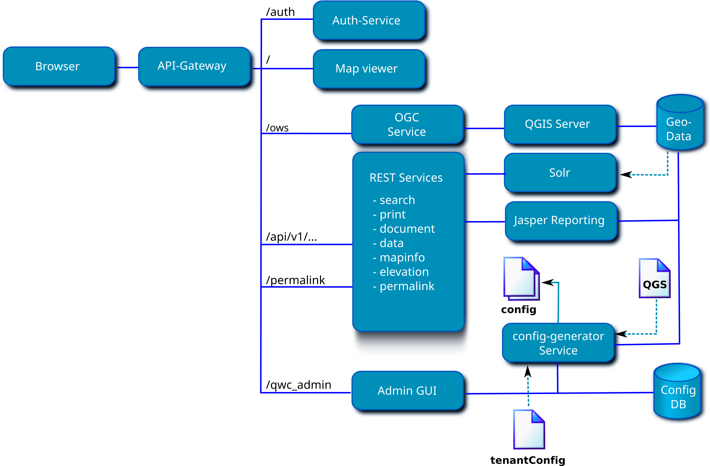

Docker containers for QWC Services
==================================

The QWC Services are a collection of microservices providing configurations for and authorized access to different [QWC2 Map Viewer](https://github.com/qgis/qwc2-demo-app) components.

This repository contains a sample setup for running QWC services with docker.

**Please consult the [upgrade notes](doc/UpgradeNotes.md) when updating the docker images.**

Table of Contents
-----------------

- [Versioning](#versioning)
- [Quick start](#quick-start)
- [Architecture overview](#architecture-overview)
- [Service overview](#service-overview)
- [Selected configuration topics](#selected-configuration-topics)
- [Resources and Permissions](#resources-and-permissions)
    - [Resources](#resources)
    - [Permissions](#permissions)
- [Group registration](#group_registration)
- [Health checks for Kubernetes](#health-checks-for-kubernetes)
- [Development](#development)

Versioning
----------

Since February 2023 a new long-term-support branch of QWC2 and its services has been introduced. The respective Docker images are tagged as `vYYYY.x-lts` (i.e. `v2023.0-lts`). This branch will receive bugfix updates for approximately one year. The sample `docker-compose-example.yml` references these images.

The latest versions of QWC2 and its services is available as before, tagged as `vYYYY-MM-DD`.

Quick start
-----------

Install docker and docker compose:

* Docker: https://docs.docker.com/engine/install/
* docker-compose: (https://docs.docker.com/compose/install/)

Clone qwc-docker and copy docker-compose and api-gateway configuration template:

    git clone https://github.com/qwc-services/qwc-docker.git
    cd qwc-docker
    cp docker-compose-example.yml docker-compose.yml
    cp api-gateway/nginx-example.conf api-gateway/nginx.conf

Create a secret key:

    python3 -c 'import secrets; print("JWT_SECRET_KEY=\"%s\"" % secrets.token_hex(48))' >.env

Permissions for writable volumes: by default, all QWC services run as `UID=33`, `GID=33`. You can either:

- Change the ownership of the writeable volumes accordingly:

      sudo chown -R 33:33 volumes/attachments
      sudo chown -R 33:33 volumes/config
      sudo chown -R 33:33 volumes/qgs-resources
      sudo chown -R 33:33 volumes/qwc2/assets

- Or change the UID/GID which runs the QWC services to match the user/group which owns the shared volumes on the host by setting `SERVICE_UID` and `SERVICE_GID` in `docker-compose.yml` under `x-qwc-service-variables`.

Set permissions for the shared solr data volume:

    sudo chown 8983:8983 volumes/solr/data

Start all containers:

    docker-compose up -d

Follow log output:

    docker-compose logs -f

Open map viewer:

    http://localhost:8088/

Open Admin GUI (Default admin credentials: username `admin`, password `admin`, requires password change on first login):

    http://localhost:8088/qwc_admin

Conntect to DB:

    psql "service=qwc_configdb" # Config DB
    psql "service=qwc_geodb" # Demo data DB

 * See [pg_service.conf](https://github.com/qwc-services/qwc-docker/blob/master/pg_service.conf)

Demo DB superuser password (please change for production use!):

* See `POSTGRES_PASSWORD` in [https://github.com/qwc-services/qwc-base-db/blob/main/Dockerfile](https://github.com/qwc-services/qwc-base-db/blob/main/Dockerfile)

Stop all containers:

    docker-compose down

Update containers:

* Change image tag for desired container in `docker-compose.yml`
* Run `docker-compose-pull <container name>`

Architecture overview
---------------------

* `API-Gateway`: API Gateway, forwards requests to individual services (http://localhost:8088)
* `Auth-Service`: Authentication service with local user database (default users: `admin:admin`, `demo:demo`) (http://localhost:8088/auth/login)
* `Map viewer`: QWC2 map viewer (http://localhost:8088)
* `OGC Service`: Proxy for WMS/WFS requests filtered by permissions, calls QGIS Server (http://localhost:8088/ows/api)
* `Admin GUI`: Admin GUI (http://localhost:8088/qwc_admin/)

Service overview
----------------

Applications:

* [QWC2 Map Viewer](https://github.com/qwc-services/qwc-map-viewer): The map viewer application
* [QWC admin GUI](https://github.com/qwc-services/qwc-admin-gui): Configuration backend for managing users and permissions
* [Registration GUI](https://github.com/qwc-services/qwc-registration-gui): GUI for registration of new users

REST services:

* [DB auth service](https://github.com/qwc-services/qwc-db-auth): Authentication service with local user database
* [LDAP auth service](https://github.com/qwc-services/qwc-ldap-auth): LDAP Authentication service
* [Data service](https://github.com/qwc-services/qwc-data-service): Data edit service, required for QWC2 editing functionality
* [Document service](https://github.com/qwc-services/qwc-document-service): Service for generating Jasper reports
* [Elevation service](https://github.com/qwc-services/qwc-elevation-service): Service for providing elevation data, required for QWC2 elevation profile
* [Feature info service](https://github.com/qwc-services/qwc-feature-info-service): Service for providing enhanced GetFeatureInfo responses to QWC2
* [Fulltext search service](https://github.com/qwc-services/qwc-fulltext-search-service): Fulltext search service for the QWC2 search functionality
* [Legend service](https://github.com/qwc-services/qwc-legend-service): Service for providing enhanced legend graphics to QWC2
* [Mapinfo service](https://github.com/qwc-services/qwc-mapinfo-service): Service for providing additional information to the QWC2 right-click map context popup
* [OGC service](https://github.com/qwc-services/qwc-ogc-service): Proxy for WMS/WFS requests filtered by permissions, calls QGIS Server
* [Permalink service](https://github.com/qwc-services/qwc-permalink-service): Service for storing compat permalinks and bookmarks generated by QWC2
* [Print service](https://github.com/qwc-services/qwc-print-service): Service for enhancing the QWC2 GetPrint requests

Configuration database:

* [DB schema and migrations](https://github.com/qwc-services/qwc-config-db)
* [Demo database](https://github.com/qwc-services/qwc-demo-db)

Configuration generator:

* [Configuration generator](https://github.com/qwc-services/qwc-config-generator)

### Overview which container accesses which volume

An overview of how each container accesses which volume can be found [here](doc/docker-volume-matrix.md).

Selected configuration topics
=============================

### Adding QGIS projects

* If necessary, setup new PG service connections:
  * Locally:

        cat >>~/.pg_service.conf <<EOF
        [qwc_example_conn]
        host=localhost
        port=5439
        dbname=qwc_example_db
        user=qwc_service
        password=qwc_service
        sslmode=disable
        EOF

  * For the QWC Docker:

        cat >>~/.pg_service.conf <<EOF
        [qwc_example_conn]
        host=qwc-postgis
        port=5432
        dbname=qwc_example_db
        user=qwc_service
        password=qwc_service
        sslmode=disable
        EOF

* Configure project for QWC2
  * Automatically generated theme configuration: Save project as `<project>.qgs` in `volumes/qgs-resources/scan/` (see [config generator configuration](https://github.com/qwc-services/qwc-config-generator))
  * Manual theme configuration: Save project as `<project>.qgs` in `volumes/qgs-resources/` and edit `volumes/config-in/default/tenantConfig.json` (see [themesConfig documentation](https://github.com/qgis/qwc2-demo-app/blob/master/doc/src/qwc_configuration.md#theme-configuration-qgis-projects-and-the-themesconfigjson-file)).
* Launch Admin GUI and generate configuration

### Editable layers

* Preconfigured example: `volumes/qgs-resources/qwc_demo.qgs`, with layers `edit_points`, `edit_lines` and `edit_polygons` configured as editable layers in the Admin GUI
* Changed the edit form type in the Attributes Form section of the QGIS layer properties dialog:
  * Autogenerate: A flat edit form will be generated for QWC2
  * Drag and Drop Designer: A grouped edit form will be generated for QWC2, the generated edit form is stored in `volumes/qwc2/assets/forms/autogen/<dataset>.ui`
  * Provide ui-file: The specified UI form (must lie next to the project in or below `volumes/qgs-resources`) will be copied to `volumes/qwc2/assets/forms/autogen/<dataset>.ui` and used by QWC2
  * See [data service documentation](https://github.com/qwc-services/qwc-data-service/blob/master/README.md)
* Update configuration in Admin GUI

### Enable Fulltext search

Make solr owner of solr data
    sudo chown 8983:8983 volumes/solr/data

    # Cleanup
    sudo rm -rf volumes/solr/data/*

    docker-compose restart qwc-solr

    curl 'http://localhost:8983/solr/gdi/dih_geodata?command=full-import'
    curl 'http://localhost:8983/solr/gdi/dih_geodata?command=status'
    curl 'http://localhost:8983/solr/gdi/select?q=search_1_stem:austr*'

    curl 'http://localhost:8983/solr/gdi/dih_metadata?command=full-import&clean=false'
    curl 'http://localhost:8983/solr/gdi/dih_metadata?command=status'
    curl 'http://localhost:8983/solr/gdi/select?q=search_1_stem:qwc_demo'

Test query for fulltext search:

    curl 'http://localhost:8983/solr/gdi/select?q=search_1_stem:austr*'

### Customize QWC2 Viewer

Use the `sourcepole/qwc-map-viewer-base` image rather than `sourcepole/qwc-map-viewer-demo` for `qwc-map-viewer` in `docker-compose.yml`.

Clone and build QWC2 Demo App (see [Quick start](https://github.com/qgis/qwc2-demo-app/blob/master/doc/src/quick_start.md)) (or use your custom QWC2 build):

    git clone --recursive https://github.com/qgis/qwc2-demo-app.git
    cd qwc2-demo-app/
    yarn install
    yarn run build

Copy QWC2 files from a build:

    SRCDIR=./qwc2-demo-app/ DSTDIR=./qwc-docker/volumes
    cp -a SRCDIR/prod/ $DSTDIR/volumes/qwc2/

Note: The viewer `config.json` and `index.html` are by default loaded from `volumes/config-in/default/`, look for `qwc2_config_file` and `qwc2_index_file` in `volumes/config-in/default/tenantConfig.json`.

Note: The config generator will automatically adjust known service URLs in `config.json` (such as `editServiceUrl`) according to the URLs specified in the `mapViewer` section of `tenantConfig.json`, i.e. `data_service_url`

### Configuration database

The [Configuration database](https://github.com/qwc-services/qwc-config-db) (ConfigDB) contains the database schema `qwc_config` for configurations and permissions of QWC services.

This database uses the PostgreSQL connection service `qwc_configdb` by default, which can be setup for the corresponding database in the PostgreSQL connection service file `pg_service.conf`. This default can be overridden by setting the environment variable `CONFIGDB_URL` to a custom DB connection string (see [below](#service-configurations)).

Additional user fields are saved in the table `qwc_config.user_infos` with a a one-to-one relation to `qwc_config.users` via the `user_id` foreign key.
To add custom user fields, add new columns to your `qwc_config.user_infos` table and set your `USER_INFO_FIELDS` accordingly (see [below](#service-configurations)).

#### Database migrations

An existing ConfigDB can be updated to the latest schema by running the database migrations from the `qwc-config-db` directory:

    git clone https://github.com/qwc-services/qwc-config-db.git
    cd qwc-config-db/
    # Install alembic, either globally or activate python virtualenv and run `pip install -r requirements.txt`)
    alembic upgrade head

Note: local PG service definition for `qwc_configdb` must exist:

    cat >>~/.pg_service.conf <<EOF
    [qwc_configdb]
    host=localhost
    port=5439
    dbname=qwc_demo
    user=qwc_admin
    password=qwc_admin
    sslmode=disable
    EOF

### Service configurations

QWC services can be configured according to the configuration schema described in the respective service READMEs in `tenantConfig.json`.

Variables can also be set as environment variables in capitalized form in `docker-compose.yml`.

Some variables must be set as environment variables in `docker-compose.yml`:

ENV                   | Default value      | Description
----------------------|--------------------|---------
`INPUT_CONFIG_PATH`   | `config-in`        | Base path for service configuration files
`OUTPUT_CONFIG_PATH`  | `/tmp`             | Base path for service configuration files
`JWT_SECRET_KEY`      | `********`         | secret key for JWT token
`TENANT_URL_RE`       | None               | Regex for tenant extraction from base URL. Example: ^https?://.+?/(.+?)/
`TENANT_HEADER`       | None               | Tenant Header name. Example: Tenant

See READMEs of services for details.

### Enabling additional services

* Add container entry in `docker-compose.yml`, ensuring the following two environment variables are set:

      - SERVICE_MOUNTPOINT=/<mountpoint>
      - JWT_SECRET_KEY=$JWT_SECRET_KEY

  Example:

      qwc-print-service:
        image: sourcepole/qwc-print-service:v2022.01.26
        environment:
          <<: *qwc-service-variables
          SERVICE_MOUNTPOINT: '/api/v1/print'
        volumes:
          - ./volumes/config:/srv/qwc_service/config:ro
        ports:
          - "127.0.0.1:5020:9090"

* Add corresponding entry in `api-gateway/nginx.conf`, example:

      location /api/v1/print {
        proxy_pass http://qwc-print-service:9090;
      }

* If necessary, uncomment/add the respective service url in the `mapViewer` config block of `volumes/config-in/default/tenantConfig.json`, i.e.

      {
        "name": "mapViewer",
        "generator_config": {
          # ...
        },
        "config": {
          "print_service_url": "/api/v1/print/",
          # ...
        }
      }

* Add the service configuration block below `services` in `volumes/config-in/default/tenantConfig.json`, according to the service config schema, i.e.

      {
        "name": "print",
        "config": {
          "ogc_service_url": "http://qwc-ogc-service:9090/",
          "qgis_server_version": "3.16"
        }
      }

Resources and Permissions
-------------------------

Permissions and configurations are based on different resources with assigned permissions in the [configuration database](https://github.com/qwc-services/qwc-config-db).
These can be managed in the [QWC configuration backend](https://github.com/qwc-services/qwc-admin-gui).

### Resources

The following resource types are available:

* `map`: WMS corresponding to a QGIS Project
    * `layer`: layer of a map
        * `attribute`: attribute of a map layer
    * `print_template`: print composer template of a QGIS Project
    * `data`: Data layer for editing
        * `attribute`: attribute of a data layer
    * `data_create`: Data layer for creating features
    * `data_read`: Data layer for reading features
    * `data_update`: Data layer for updating features
    * `data_delete`: Data layer for deleting features
* `viewer`: custom map viewer configuration
* `viewer_task`: permittable viewer tasks

The resource `name` corresponds to the technical name of its resource (e.g. WMS layer name).

The resource types can be extended by inserting new types into the `qwc_config.resource_types` table.
These can be queried, e.g. in a custom service, by using `PermissionClient::resource_permissions()` or
`PermissionClient::resource_restrictions()` from [QWC Services Core](https://github.com/qwc-services/qwc-services-core).

Available `map`, `layer`, `attribute` and `print_template` resources are collected from WMS `GetProjectSettings` and the QGIS projects.

`data` and their `attribute` resources define a data layer for the [Data service](https://github.com/qwc-services/qwc-data-service).
Database connections and attribute metadata are collected from the QGIS projects.

For more detailed CRUD permissions `data_create`, `data_read`, `data_update` and `data_delete` can be used instead of `data`
(`data` and `write=False` is equivalent to `data_read`; `data` and `write=True` is equivalent to all CRUD resources combined).

The `viewer` resource defines a custom viewer configuration for the map viewer (see [Custom viewer configurations](https://github.com/qwc-services/qwc-map-viewer#custom-viewer-configurations)).

The `viewer_task` resource defines viewer functionalities (e.g. printing or raster export) that can be restricted or permitted.
Their `name` (e.g. `RasterExport`) corresponds to the `key` in `menuItems` and `toolbarItems` in the QWC2 `config.json`. Restricted viewer task items are then removed from the menu and toolbar in the map viewer. Viewer tasks not explicitly added as resources are kept unchanged from the `config.json`.

### Permissions

Permissions are based on roles. Roles can be assigned to groups or users, and users can be members of groups.
A special role is `public`, which is always included, whether a user is signed in or not.

Each role can be assigned a permission for a resource.
The `write` flag is only used for `data` resources and sets whether a data layer is read-only.

Based on the user's identity (user name and/or group name), all corresponding roles and their permissions and restrictions are collected.
The service configurations are then modified according to these permissions and restrictions.

Using the `DEFAULT_ALLOW` environment variable, some resources can be set to be permitted or restricted by default if no permissions are set (default: `False`). Affected resources are `map`, `layer`, `print_template` and `viewer_task`.

e.g. `DEFAULT_ALLOW=True`: all maps and layers are permitted by default
e.g. `DEFAULT_ALLOW=False`: maps and layers are only available if their resources and permissions are explicitly configured

### Permissions file

The [QWC Config Generator](https://github.com/qwc-services/qwc-config-generator) generates a JSON file for all permissions ([JSON schema](https://github.com/qwc-services/qwc-services-core/blob/master/schemas/qwc-services-permissions.json)) from the QWC ConfigDB. See READMEs of QWC services for service specific contents in `permissions.json`.

Alternatively, a simplified permissions format is also supported, see [unified permissions](doc/unified_permissions.md).

Group registration
------------------

Using the optional [Registration GUI](https://github.com/qwc-services/qwc-registration-gui) allows users to request membership or unsubscribe from registrable groups. These requests can then be accepted or rejected in the [Admin GUI](https://github.com/qwc-services/qwc-admin-gui).

Workflow:
* Admin GUI
  * admin user creates new groups with assigned roles and permissions on resources
  * admin user configures registrable groups
* Registration GUI
  * user select desired groups from registrable groups and submits application form
  * admin users are notified of new registration requests
* Admin GUI
  * admin user selects entry from list of pending registration requests
  * admin user accepts or rejects registration requests for a user
  * user is added to or removed from accepted groups
  * user is notified of registration request updates
* Map Viewer
  * user permissions are updated for new groups

Health checks for Kubernetes
----------------------------

Health checks are a simple way to let the system know if an instance of the app is working or not working. If an instance of the app is not working, then other services should not access it or send a request to it. Instead, requests should be sent to another instance of the app that is ready, or retried at a later time. The system should also bring the app back to a healthy state.

### Readyness:

Readiness probes are designed to let Kubernetes know when the app is ready to serve traffic. Kubernetes makes sure the readiness probe passes before allowing a service to send traffic to the pod. If a readiness probe starts to fail, Kubernetes stops sending traffic to the pod until it passes.

**Check is available at: /ready**

Example check:

* Return ok, if web service is initialized and running

### Liveness:

**Check is available at: /healthz**

Liveness probes let Kubernetes know if the app is alive or dead. If the app is alive, then Kubernetes leaves it alone. If the app is dead, Kubernetes removes the Pod and starts a new one to replace it.

Example checks:

* Check database connection (Example service: qwc-admin-gui)
* Check if all data files are available and readable (Example service: qwc-elevation-service)

Development
-----------

Create a QWC services dir:

    mkdir qwc-services
    cd qwc-services/

Clone [QWC Config DB](https://github.com/qwc-services/qwc-config-db):

    git clone https://github.com/qwc-services/qwc-config-db.git

Clone [QWC Config service](https://github.com/qwc-services/qwc-config-service):

    git clone https://github.com/qwc-services/qwc-config-service.git

Clone [QWC OGC service](https://github.com/qwc-services/qwc-ogc-service):

    git clone https://github.com/qwc-services/qwc-ogc-service.git

Clone [QWC Data service](https://github.com/qwc-services/qwc-data-service):

    git clone https://github.com/qwc-services/qwc-data-service.git

Clone [QWC Map Viewer](https://github.com/qwc-services/qwc-map-viewer):

    git clone https://github.com/qwc-services/qwc-map-viewer.git

Clone [QWC Admin GUI](https://github.com/qwc-services/qwc-admin-gui):

    git clone https://github.com/qwc-services/qwc-admin-gui.git

See READMEs of each service for their setup.

Setup your ConfigDB and run migrations (see [QWC Config DB](https://github.com/qwc-services/qwc-config-db)).

Run local services (set `$QGIS_SERVER_URL` to your QGIS server and `$QWC2_PATH` to your QWC2 files):

    cd qwc-config-service/
    QGIS_SERVER_URL=http://localhost:8001/ows/ QWC2_PATH=qwc2/ python server.py

    cd qwc-ogc-service/
    QGIS_SERVER_URL=http://localhost:8001/ows/ CONFIG_SERVICE_URL=http://localhost:5010/ python server.py

    cd qwc-data-service/
    CONFIG_SERVICE_URL=http://localhost:5010/ python server.py

    cd qwc-map-viewer/
    OGC_SERVICE_URL=http://localhost:5013/ CONFIG_SERVICE_URL=http://localhost:5010/ QWC2_PATH=qwc2/ python server.py

    cd qwc-admin-gui/
    python server.py

Sample requests:

    curl 'http://localhost:5010/ogc?ows_type=WMS&ows_name=qwc_demo'
    curl 'http://localhost:5010/qwc'
    curl 'http://localhost:5013/qwc_demo?VERSION=1.1.1&SERVICE=WMS&REQUEST=GetCapabilities'
    curl 'http://localhost:5012/qwc_demo.edit_points/'
    curl 'http://localhost:5030/themes.json'
    curl 'http://localhost:5031'

To build containers for local services, in use `build:` rather than `image:` in `docker-compose.yml`:

    qwc-print-service:
      # image: sourcepole/qwc-print-service:v2022.01.13
      build:
        context: ./qwc-services/qwc-print-service
      # [...]
